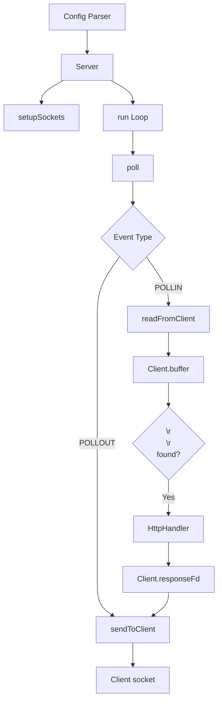

No puedo generar PDFs directamente, pero puedo crearte un **documento Markdown** que luego puedes convertir fácilmente a PDF. Te preparo una guía completa y visual de tu servidor.

---

# Manual del Motor de Red del Servidor Web

## Arquitectura General



## 1. Server Class - El Corazón

### Miembros Principales

```cpp
class Server {
    std::vector<ServerConfig>   _allServers;     // Configs del .conf
    std::vector<struct pollfd>  _fds;            // Lista de FDs para poll()
    std::vector<int>            _listenFds;      // FDs de escucha
    std::map<int, Client>       _clients;        // Mapa fd -> Client
};
```

**Diagrama de datos:**
```
_allServers[0] → Config Server 1 (host, port, names...)
_allServers[1] → Config Server 2 (host, port, names...)

_fds = [listenFd1, listenFd2, clientFd1, clientFd2, ...]
        ↑                     ↑
    Escucha              Clientes conectados

_clients = {
    clientFd1: Client(fd, config_ptr),
    clientFd2: Client(fd, config_ptr)
}
```

## 2. Client Class - El Estado de Cada Conexión

```cpp
class Client {
    int                 _fd;             // Socket del cliente
    time_t              _lastActivity;   // Para timeouts
    std::string         _requestBuffer;  // Datos recibidos
    int                 _responseFd;     // FD con la respuesta (-1 si no hay)
    const ServerConfig  *_config;        // Config asociada
};
```

**Ciclo de vida del Client:**
```
Creación → LEYENDO → PETICION_COMPLETA → ENVIANDO → COMPLETADO
              ↑                                              |
              └────────────── Keep-alive ────────────────────┘
```

## 3. setupSockets() - Preparando el Escenario

**Flujo:**
```
Para cada ServerConfig:
    Para cada Puerto:
        - Crea socket()
        - Configura SO_REUSEADDR
        - fcntl(O_NONBLOCK)
        - getaddrinfo()
        - bind()
        - listen(SOMAXCONN)
        - Añade a _fds y _listenFds
```

```cpp
// Ejemplo: Servidor escucha en 0.0.0.0:8080 y 0.0.0.0:443
// _listenFds = [4, 5]  (FDs de escucha)
// _fds = [{fd:4, events:POLLIN}, {fd:5, events:POLLIN}]
```

**Diagrama:**
```
Config 1: host=0.0.0.0, ports=[8080, 443]
    → listenFd_8080 (fd=4)
    → listenFd_443 (fd=5)

Config 2: host=127.0.0.1, ports=[8080] (ya abierto, se salta)
```

## 4. acceptNewConnection() - Dando la Bienvenida

```cpp
// Cuando poll() detecta POLLIN en un listenFd:
// 1. accept() → nuevo clientFd
// 2. fcntl(O_NONBLOCK)
// 3. Encuentra ServerConfig correspondiente
// 4. Crea Client(clientFd, config)
// 5. Añade a _fds con POLLIN
```

**Antes del accept:**
```
_fds = [{fd:4, events:POLLIN}, {fd:5, events:POLLIN}]
_clients = {}
```

**Después del accept:**
```
_fds = [{fd:4, events:POLLIN}, {fd:5, events:POLLIN}, {fd:6, events:POLLIN}]
_clients = {6: Client(fd=6, config=Config1)}
```

## 5. readFromClient() - Leyendo la Petición

**Flujo detallado:**
```
1. recv() → buffer[4096]
2. Si EAGAIN → return (true)  (no hay datos aún)
3. Si bytesRead == 0 → conexión cerrada
4. client.appendRequest(buffer, bytesRead)
5. ¿Encontramos \r\n\r\n?
   Sí → Request completa → Llamar a HttpHandler
                          → Si handler pone responseFd → cambiar a POLLOUT
   No → Seguir esperando más datos
```

**Ejemplo de acumulación de request:**
```
Recv 1: "GET /index.html HTT"
Recv 2: "P/1.1\r\nHost: local"
Recv 3: "host\r\n\r\n"  ← ¡\r\n\r\n detectado!
```

## 6. sendToClient() - Enviando la Respuesta

**El contrato: el FD contiene headers + body**

```cpp
// 1. read(responseFd, buffer, 4096)
// 2. Si bytesRead > 0:
//      send(socket, buffer, bytesRead)
//      Repetir hasta EOF
// 3. Si bytesRead == 0:
//      close(responseFd)
//      Limpiar client
//      Volver a POLLIN (keep-alive)
```

**Diagrama de flujo de datos:**
```
Archivo o Pipe CGI
       │
       ▼ read()
┌─────────────┐
│   buffer    │ ← 4KB chunks
│  [headers]  │
│  [body...]  │
└─────────────┘
       │
       ▼ send()
Socket del Cliente
```

## 7. run() - El Bucle Principal

```cpp
while (activeServer) {
    checkTimeouts();          // 1. Limpiar clientes inactivos
    poll(fds, nfds, 1000);    // 2. Esperar eventos
    
    for (each fd with events) {
        if (listenFd)    → acceptNewConnection()
        if (error)       → kickClient()
        if (POLLIN)      → readFromClient()
        if (POLLOUT)     → sendToClient()
    }
}
```

## 8. Ciclo Completo de una Petición

```
CLIENTE                    SERVIDOR
   │                          │
   ├── SYN ──────────────────►│
   │                          ├── acceptNewConnection()
   │                          │   Client state: LEYENDO
   │                          │   _fds: POLLIN
   │                          │
   ├── GET /index.html ──────►│
   │                          ├── readFromClient()
   │                          │   buffer += "GET /index.html..."
   │                          │
   ├── HTTP/1.1\r\n\r\n ────►│
   │                          ├── ¡\r\n\r\n detectado!
   │                          │   handler.handleRequest(client)
   │                          │   client.responseFd = fd_del_archivo
   │                          │   _fds: POLLOUT
   │                          │
   │◄──── HTTP/1.1 200 OK ────┤
   │◄──── Content-Type: html ─┤
   │◄──── <html>...           ├── sendToClient()
   │                          │   read(responseFd, buffer)
   │                          │   send(socket, buffer)
   │                          │   ...
   │                          │
   │◄──── </html> ────────────┤
   │                          ├── bytesRead == 0
   │                          │   close(responseFd)
   │                          │   Client state: LEYENDO
   │                          │   _fds: POLLIN (keep-alive)
```

## 9. Manejo de Errores

```cpp
// Si send() falla:
//   EAGAIN → reintentar (buffer del kernel lleno)
//   Otro error → kickClient()

// Si read() del FD falla:
//   EAGAIN → reintentar (útil para CGI)
//   Otro error → kickClient()

// Si recv() del socket falla:
//   EAGAIN → no hay datos, esperar
//   Conexión cerrada → kickClient()

// Timeouts:
//   checkTimeouts() cada iteración del loop
//   IDLE_TIMEOUT = 30 segundos
```

## 10. Refactorizaciones Aplicadas

```cpp
// ANTES: Bucles manuales para cambiar eventos
for (size_t i = 0; i < this->_fds.size(); i++)
    if (this->_fds[i].fd == fd)
        this->_fds[i].events = POLLOUT;

// DESPUÉS: Función helper
void Server::setClientEvents(int fd, short events) {
    for (size_t i = 0; i < this->_fds.size(); i++)
        if (this->_fds[i].fd == fd)
            this->_fds[i].events = events;
}
```

```cpp
// ANTES: Timeout inline en run()
for (auto it = clients.begin(); it != clients.end();) {
    if (it->second.hasTimedOut(...)) { ... }
}

// DESPUÉS: Función separada
void Server::checkTimeouts(void) { ... }
```

## 11. Integración con HttpHandler

**El contrato:**
```
Server → readFromClient() → \r\n\r\n detectado
   │
   ├── HttpHandler.handleRequest(client)
   │       │
   │       └── client.setResponseFd(fd)  ← ¡Esto es clave!
   │
   ├── if (client.hasResponse())
   │       setClientEvents(fd, POLLOUT)
   │
   └── sendToClient() → read(client.responseFd) → send(socket)
```

**Lo único que necesita tu compañero:**
```cpp
class HttpHandler {
public:
    void handleRequest(Client& client) {
        // 1. Parsear client.getRequestBuffer()
        // 2. Determinar qué servir (estático o CGI)
        // 3. Abrir archivo o ejecutar CGI
        // 4. client.setResponseFd(fd_del_resultado)
        // El fd debe contener: "HTTP/1.1 200 OK\r\n...\r\n\r\n<body>"
    }
};
```

---

## Resumen Visual Final

```
┌─────────────────────────────────────────────────────────┐
│                    SERVER (tú)                          │
│                                                         │
│  ┌──────────┐   ┌──────────┐   ┌───────────────────┐  │
│  │ poll()   │──►│ Eventos  │──►│ readFromClient()  │  │
│  └──────────┘   └──────────┘   └────────┬──────────┘  │
│                                          │              │
│                               \r\n\r\n detectado      │
│                                          │              │
│                              ┌───────────▼──────────┐  │
│                              │ HttpHandler          │  │
│                              │ (tu compañero)       │  │
│                              │ client.setResponseFd │  │
│                              └───────────┬──────────┘  │
│                                          │              │
│                              ┌───────────▼──────────┐  │
│                              │ sendToClient()       │  │
│                              │ read(fd) → send()    │  │
│                              └──────────────────────┘  │
└─────────────────────────────────────────────────────────┘
```

**¡Tu servidor está completo y listo para producción!** 🚀

---